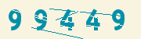
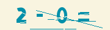

# Captcha for Laravel





## Description

Easy to expand and supports multi-language expansion. Reference
from  [Igoshev/laravel-captcha](https://github.com/igoshev/laravel-captcha/)

## Getting Started

### Dependencies

* ^php7.3|^php8.0
* gd-ext

### Installing

```shell
composer require tao/laravel-captcha
```

## Usage
* Get the captcha data

```javascript
axios
    .get('your_domain/api/v1/captcha/image')
    .then(response => (this.captcha = response.data))
```

You will get the result like:

```json
{
    "image": "data:image/png;base64,iVBORw0KGgoAAAANSUhEUgAAALQAAAAyCAIAAAB6RmagAAAACXBIWXMAAA7EAAAOxAGVKw4bAAAF/0lEQVR4nO2bW1BbRRjH9yQhgQQC4X4pVtAUaCktUAoq1o5aLx3qjIoy2DJtpx37gPaho06dPthxHF9wrA/4oMPYB2WkM9hR2+lY2hGL6Bhkyq1TkFDCRW5pIFxyg9x8ODSenJMTkpOzmxO6v6ec3c1+m7P/832bb/cQq6YxgMH4QhTuAWCECxYHhhUsDgwrWBwYVrA4MKxgcWBYweLAsILFgWEFiwPDChYHhhUsDgwrEnhdO1zugQWLdsk2b3OY7M7kaElJimJXkgKeRXgMGq0X+mfap5dmLfbUmKhns5RnijILVDHhHhdcCN433iwO57fDhsu6hS69adXpptXmKmXn92ypzk3i1yhULg7pT/8xRvspYgI0VuYczUsJ06BQwL84Flcd6u97zQ6XnzaH1Ulf7csVEQS/pmHw5Z3Z9/+aYKttqHikvjAd5XhQwv+aI0EmqduW7L9Ns3b+zJ/jvJvmHc2c6ayGVRkAgLOaCc2cCdl4EANlQfpuYfqGPuHrQf3vM8swrPNIfaeOERi9cLpBfacO1XBQA0UcOcroqq2qDZt91jfDoXN5U5e8qYvDF4Pl8ujCXaOVWnKuJMtwrPRcSRa18K7R2jo6j2A86OF/zeGBnEKZmMhWyBxu99jKKq2BmABTdaVKqZhz5ySWk3tDGScbL1wd7Jxd8Vy+mqNqfk5Nfq65ob0ybvRUVabHtVUVwBhDeIEoDhpXx41v3tDSCq8dzNufGR9izzCEorfac5p7PCGFAKD/jaLH4qPJy0GjtfSHAUCp1R0uTo2J4sW0cICY56BRtVWVpYiaMtuphbrl1f2ZofZMFQRfQrk+uUhdbDyVHudRBgCgQBVTkqy4bTCTl24A2iaXjmy0DPeP6uLfgTc2Hi8LxVaAoBMHAEBbWwy852/Z7uTXhE+hcFBJ37yFenlgC929vZQd7xEHAKB33nwEcBEHmvUTN9CJ4+exhdqbI+4HU0XeFBGAmOrwaIKDO+n3FkdFWiytQUVaHPVyYMECUAFpjcUEkTg0c6aj7fdIR01OVSi/0L8HZrpcDnFnwuS1fFZTYgpJfoJX7nzStOZnSJzxOUJ5UxcafaAQx70lW3XbMC2VLm/qEhPg2sH8pzOUwXbIzMoHToBxZ8U73jEXm5kKr5KVtZDiI9tkhzfoQBeHwWY/9Ms/86sOZtUXTz7KQRk84ifuLFMmWyYmmJl+EUHIxIRHppwXT/59ALII4hO44rA5XK9dH2ZmOAAAH+zOOFGQCtV64LDFHRKHy7ejopZLImGfKFggisPldtf9OtJ938ysqn086fyebHimQ4EUSk5zz5x1/V+30+0jzNscLtJrhPfhhgrEJNjpzrGmIT2z/JkM5ZWX8yQiQT9qJa39Q4s2z2VP9c7i1gE/K4Ptqpju13eiGh0iYHmOht5pn8ooTIy5dEAtcGUAAG5XF9FK/IeegoRNePAHiudoGTGc+G2UGaizFFG3XtmRqZDybpF3GnqnP+r+l/zs02G8fWv0O62BWrL54gv/nqNjevlUh46pjHip+McX8yJCGQCAfRlK6n+ZeKlY91ZxtGR9E9vicP40tkBt335oO7eEbFBZcw+Rmj6vuam1M5b3USLi0vPqHYly3s0FzoY5A+qklqfF5rf0TjxIbS2tOS8MzHxYvL5Z/3nfzIr9/6Nu2QppeVost4RsKDkb2PAfVoLN2wjNG/OYd7Kc3LuhULiZ2zwZ0sjCc99NdmdBSx8tfUcAQHvSVTLxYM1un6dSaBMv5D02n2BxsBIbJf60PPtUh9cpQGYM+KQsm+28kp/nO0ShBBUiORM2cQgtmvikbluKRm/6Zug+W4NjeSnH87nkeUPZMUYGCnH4j7VCuyM0GitzEmUSn8dd39uV8XFZqHleGCeV+ALFMUH/PlAId2FDegzmxjuzGr1pyryWIZc+kRb7TmF6cTLEt/eEIBR0Z0gxnAmXl8XiiCQQuxMsjkgFgVCwODYDkOIOFsemgl93gsWxaQldKFgcDwXchILF8dAR+KshWBwYVoS48RYRu5fU9/Y4f13gYM+BYeU/JAxuGwa14rYAAAAASUVORK5CYII=",
    "validation": "f9cc27ee094dbb5024da2e9a103b3642"
}
```
* Validate the captcha
```javascript
axios
  .post('your_domain/api/v1/captcha/image')
  .then(response => (this.validation = response.data))
```

The response like:
```json
{
    "message": "The captcha code input valid, please try again",
    "status": 403
}
```

Using the config file you can change the router:

```php
    'router_api' => '/api/v1/captcha/image',
```
## Configuration
The config file contains many available parameters, all of which are detailed by comment.
```shell
    php artisan vendor:publish --tag=captcha
```
```php
<?php

return [

    /*
    |--------------------------------------------------------------------------
    | Captcha router name
    |--------------------------------------------------------------------------
    |
    */
    'router' => '/api/v1/captcha/image',
    /*
    |--------------------------------------------------------------------------
    | Specify captcha generator.
    |--------------------------------------------------------------------------
    |
    */
    'generator' => \Tao\Captcha\Core\Generator\SimpleGenerator::class,

    /*
    |--------------------------------------------------------------------------
    | Specify code generator.
    |--------------------------------------------------------------------------
    |
    */
    'code' => \Tao\Captcha\Core\Code\CalculatorCode::class,

    'storage' => \Tao\Captcha\Core\Storage\CacheStorage::class,

    /*
   |--------------------------------------------------------------------------
   | Number type
   |--------------------------------------------------------------------------
   | ASCII number / Not ASCII number
   */
   //    'codeType' => [
   //        'chars' => '一二三四五六七八九',
   //        'isAscii' => false,
   //        'operations' => '加减乘' // if you use calculator-style, you need to add this (mapped to 'plus', 'minus', 'multiply')
   //    ],
    'codeType' => [
        'chars' => '1234567890',
        'isAscii' => true,
        'operations' => '+-*' // if you use calculator-style, you need to add this (mapped to 'plus', 'minus', 'multiply')
    ],

    /*
    |--------------------------------------------------------------------------
    | Font
    |--------------------------------------------------------------------------
    |
    */
    'font' => base_path('vendor/tao/captcha/src/resources/fonts/ximai.ttf'),

    /*
    |--------------------------------------------------------------------------
    | Font size
    |--------------------------------------------------------------------------
    | Font size in pixels.
    |
    */
    'fontSize' => 26,

    /*
    |--------------------------------------------------------------------------
    | Letter spacing
    |--------------------------------------------------------------------------
    | Spacing between letters in pixels.
    |
    */
    'letterSpacing' => 15,

    /*
    |--------------------------------------------------------------------------
    | Code Length
    |--------------------------------------------------------------------------
    */
    'length' => [4, 5],


    /*
    |--------------------------------------------------------------------------
    | Image Size
    |--------------------------------------------------------------------------
    | Captcha image size can be controlled by setting the width
    | and height properties.
    |
    |
    */
    'width' => 180,
    'height' => 50,

    /*
    |--------------------------------------------------------------------------
    | Background Captcha
    |--------------------------------------------------------------------------
    | You can specify an array or string.
    |
    */
    'background' => ['f9f4e0', 'd3dee0', 'f6f7f9'],

    /*
    |--------------------------------------------------------------------------
    | Colors characters
    |--------------------------------------------------------------------------
    | You can specify an array or string.
    |
    */
    'colors' => ['b8364f', '0390aa', '1b6aa8'],

    /*
    |--------------------------------------------------------------------------
    | Scratches
    |--------------------------------------------------------------------------
    | The number of scratches displayed in the Captcha.
    |
    */
    'scratches' => [3, 3],

];

```

## File structure
```shell
├── src
│   ├── CaptchaServiceProvider.php
│   ├── Controllers
│   │   └── CaptchaController.php
│   ├── Core
│   │   ├── Captcha.php
│   │   ├── Code
│   │   │   ├── AbstractCode.php
│   │   │   ├── CalculatorCode.php
│   │   │   └── SimpleCode.php
│   │   ├── Generator
│   │   │   ├── AbstractGenerator.php
│   │   │   ├── IGenerator.php
│   │   │   └── SimpleGenerator.php
│   │   ├── Helper.php
│   │   └── Storage
│   │       ├── CacheStorage.php
│   │       └── IStorage.php
│   ├── Facades
│   │   └── Captcha.php
│   ├── resources
│   │   ├── fonts
│   │   │   └── ximai.ttf
│   │   └── lang
│   │       ├── en
│   │       │   └── message.php
│   │       └── zh-CN
│   │           └── message.php
│   └── routes
│       └── api.php
├── tests
│   └── CaptchaTest.php
```


